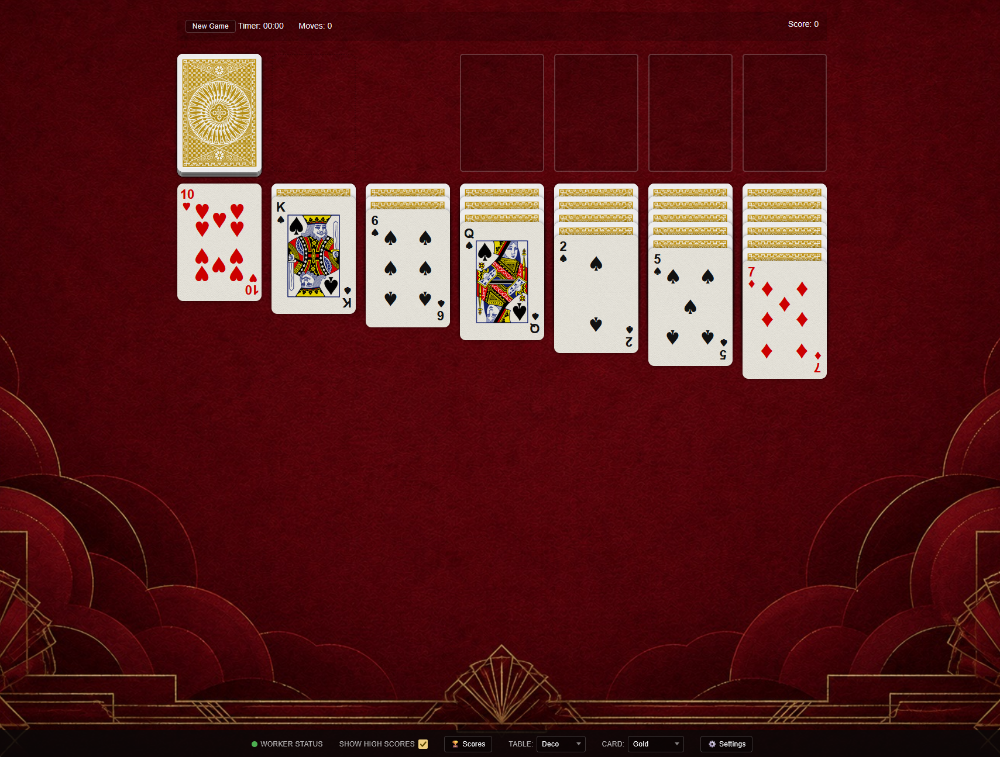

# solitaire-js

A fully client-side Klondike Solitaire game built with vanilla HTML, CSS, and JavaScript. No frameworks, no dependencies, no server required.

🎮 **[Play the Demo](https://badbox29.github.io/solitaire-js/index.html)**

---

## Screenshot


---

## Features

### Gameplay
- Standard Klondike Solitaire rules
- Draw one card at a time from the stock pile
- Move single cards or entire face-up stacks between tableau columns
- Double-click any card to automatically send it to the correct foundation pile
- **Flexible ace placement** — aces can be placed in any of the four foundation slots, not just their matching suit slot, and can be repositioned between slots afterward
- **New Game button** — start a fresh deal at any time without reloading the page
- Auto-Win button appears when all remaining cards are face-up, completing the game automatically with animation
- Confetti celebration on winning

### Controls
- **Click** a card to select it, click a destination to move it
- **Double-click** a card to auto-send it to the foundation
- **Drag and drop** — full support for both mouse (desktop) and touch (mobile/tablet)
- **Pause/Resume** button for the game timer

### Scoring
- Standard Vegas-style scoring system
- Waste → Tableau: +5 pts
- Waste → Foundation: +10 pts
- Tableau → Foundation: +10 pts
- Flip a face-down tableau card: +5 pts
- Foundation → Tableau: −15 pts
- Recycle the waste pile: −100 pts
- Score decays by 2 pts every 10 seconds
- Time-based bonus points on completion (700,000 ÷ seconds elapsed)

### High Scores
- Top 100 scores saved locally via localStorage
- Win modal displays a ranked leaderboard centered on your current score
- **🏆 Scores button** in the bottom bar opens the leaderboard at any time
- **Show High Scores toggle** — if unchecked, the win modal and Scores button are hidden
- **🔄 Refresh button** inside the win modal pulls the latest friend scores from KV sync

### Customization
- **Table color picker** — switch the felt background on the fly; available in Green, Blue, Red, Brown, Grey, Purple, Vines, Ocean, Deco, Desert, Gothic, and Moonlight
- **Card back picker** — switch card back designs on the fly; multiple designs supported
- **Persistent preferences** — table color and card back selection are saved to browser localStorage and automatically restored when you return to the game, even after the browser tab has been killed and reloaded by the OS

### KV Sync (Cross-Device & Social)
- Optional Cloudflare Worker + KV integration for syncing scores and preferences across devices and browsers
- **Register** a unique username tied to a secure token — no passwords, no accounts
- **Connect** an existing account on a new device by pasting your token
- **Score sync** — your top 100 scores are pushed to KV on every win and pulled on page load, merging with local scores and keeping the best 100
- **Preference sync** — table background and card back selections sync across devices; newest setting always wins
- **Friends** — search for other players by username and follow them; their scores appear in your leaderboard merged with yours, distinguished by a blue username badge
- **Worker Status indicator** — green/red dot in the bottom bar shows live connection status once KV sync is configured
- **⚙️ Settings button** in the bottom bar opens the sync configuration panel

#### Setting Up KV Sync
1. Deploy the included Cloudflare Worker (see `/worker/index.js`) with a bound KV namespace
2. Open ⚙️ Settings in the game, enter your Worker URL, pick a username, and click Register
3. Copy your token to any other device, open Settings there, paste the token, and click Connect

#### Security Model
- Tokens are generated server-side and never exposed publicly
- Only the token holder can write scores or preferences for an account
- Anyone can read scores by username (used for the friends feature)
- Usernames are case-insensitive; allowed characters are letters, numbers, hyphens, and underscores (3 character minimum)

### Technical
- Zero external dependencies — Bootstrap replaced with a minimal hand-crafted reset
- Fully self-hosted — all assets (fonts, images, CSS) served locally
- Responsive layout that works across desktop, tablet, and mobile screen sizes
- Touch drag-and-drop uses native touch events with a floating card clone and drop target highlighting
- Pull-to-refresh disabled during gameplay on mobile
- Pinch-to-zoom and double-click zoom disabled during gameplay on mobile (to protect viewport lock)
- Settings persist via localStorage — KV sync is entirely optional

---

## Project Structure

```
├── index.html
├── css/
│   └── style.css
├── js/
│   └── script.js
├── img/
│   ├── green_felt.jpg
│   ├── blue_felt.jpg
│   ├── red_felt.jpg
│   ├── brown_felt.jpg
│   ├── grey_felt.jpg
│   ├── purple_felt.jpg
│   ├── vines_felt.jpg
│   ├── ocean_felt.jpg
│   ├── deco_felt.jpg
│   ├── desert_felt.jpg
│   ├── gothic_felt.jpg
│   ├── moonlight_felt.jpg
│   ├── card_back_bg.png
│   ├── card_back_bg_gold.png
│   ├── card_back_bg_black.png
│   ├── card_back_bg_cream.png
│   ├── card_back_bg_chalice.png
│   ├── card_back_bg_champagne.png
│   ├── card_back_bg_mustache.png
│   ├── card_back_bg_pearls.png
│   ├── card_face_bg.png
│   └── face-[rank]-[suit].png  (12 face card images)
├── fonts/
│   └── suit-regular.*  (card suit font, 4 formats)
└── worker/
    └── index.js  (Cloudflare Worker for KV sync)
```

---

## Cloudflare Worker API

The worker exposes six endpoints:

| Method | Endpoint | Auth | Description |
|--------|----------|------|-------------|
| POST | `/register` | None | Register a new username, returns token |
| POST | `/connect` | Token | Validate token, returns username + scores |
| POST | `/sync` | Token | Merge and save scores, returns merged list |
| POST | `/prefs` | Token | Sync preferences, newest timestamp wins |
| GET | `/user/{username}` | None | Get public scores for any user |
| GET | `/search/{username}` | None | Check username availability |

---

## Adding Card Backs

Drop any PNG into the `/img/` folder and add an `<option>` to the card back `<select>` in the `#bottom-bar` section of `index.html`:

```html
<option value="your_filename.png">Your Label</option>
```

The picker and localStorage persistence handle the rest automatically.

---

## Running Locally

No build step needed. Just serve the root directory with any static file server:

```bash
# Python
python3 -m http.server 8080

# Node.js (npx)
npx serve .
```

Then open `http://localhost:8080` in your browser.

---

## Credits

Originally forked from [solitaire-js by bfa](https://github.com/bfa/solitaire-js). Extended with drag-and-drop, flexible foundation rules, customization controls, persistent preferences, high score tracking, cross-device KV sync, and a self-hosted asset pipeline.

Card suit font by [@donpark](https://donpark.github.io/scalable-css-playing-cards/).
